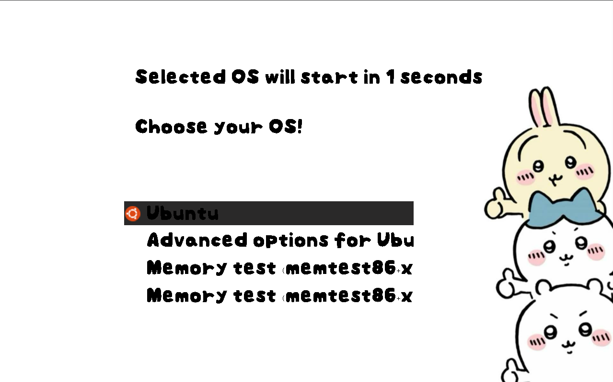

# Chiikawa GRUB Theme


Cute Chiikawa-themed GRUB skin. Assets are minimized so it runs smoothly even in VMs like VirtualBox.<br>
Subject to removal at any time upon request by the copyright owner. This is a non-profit fan project.

## Files
- `theme.txt`: theme definition (background, font, menu, selection highlight)
- `chiikawa_wallpaper.jpg`: background image (JPG)
- `ok_mallang_24.pf2`: global font
- `select_bkg_*.png`: selection bar 9-slice pieces
- `icons/*.png`: boot entry icons (downsized)

## Install
1) Copy the theme folder
   ```bash
   sudo mkdir -p /boot/grub/themes/chiikawa-theme
   sudo cp -r . /boot/grub/themes/chiikawa-theme
   ```
2) Point GRUB to the theme (`/etc/default/grub`)
   ```
   GRUB_THEME="/boot/grub/themes/chiikawa-theme/theme.txt"
   ```
3) Apply config
   ```bash
   sudo update-grub
   ```
4) Reboot and check the theme


